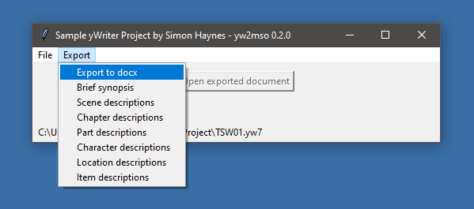

[yWriter](http://spacejock.com/yWriter7.html) is a free word processor written by Australian author and programmer Simon Haynes. yWriter's strengths are structuring novels and controlling the progress during the writing process. Use this Python script to generate your manuscript and various reports in Open XML *docx* format.

## Features (a Python 3 installation is required)

- Generate a "standard manuscript" formatted **Open XML text document (docx)** from a yWriter 7 project.
- Generate a **brief synopsis** with chapter and scene titles from a yWriter 7 project.
- Generate documents containing **scene descriptions** and **chapter/part descriptions**.
- Generate **character sheets**, **location sheets**, and **item sheets** in docx format.
  
## Requirements

- Windows.
- [Python 3.6+](https://www.python.org).  

## Download and install

[Download the latest release (version 0.4.1)](https://raw.githubusercontent.com/peter88213/yw2yw2oxmlllin/dist/yw2oxml.99.0.zip)

[Instructions for installation and use](usage)

[Changelog](changelog)

## License

yw2oxmlxmlxml distributed under the [MIT License](http://www.opensource.org/licenses/mit-license.php).

 

